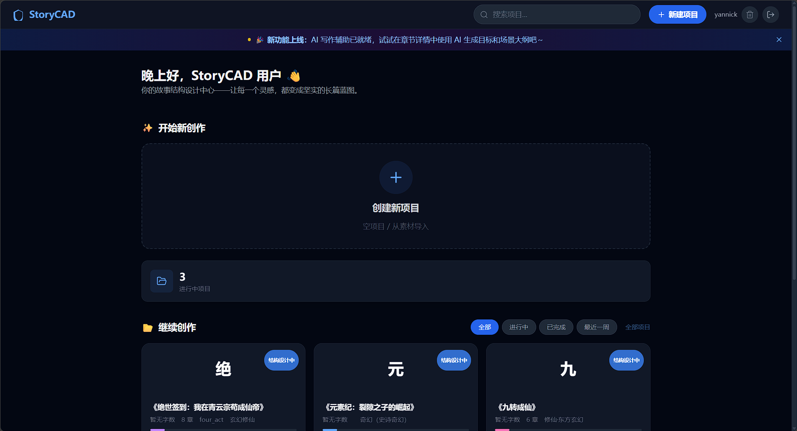
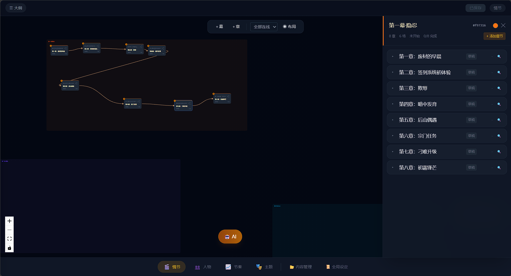
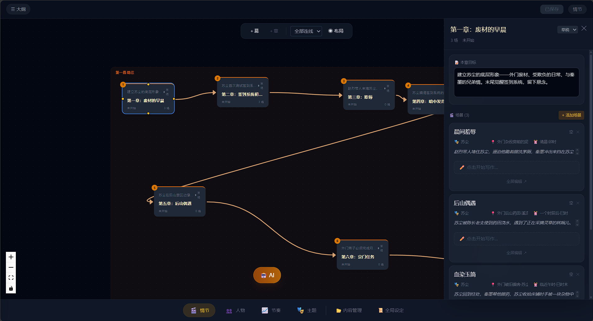
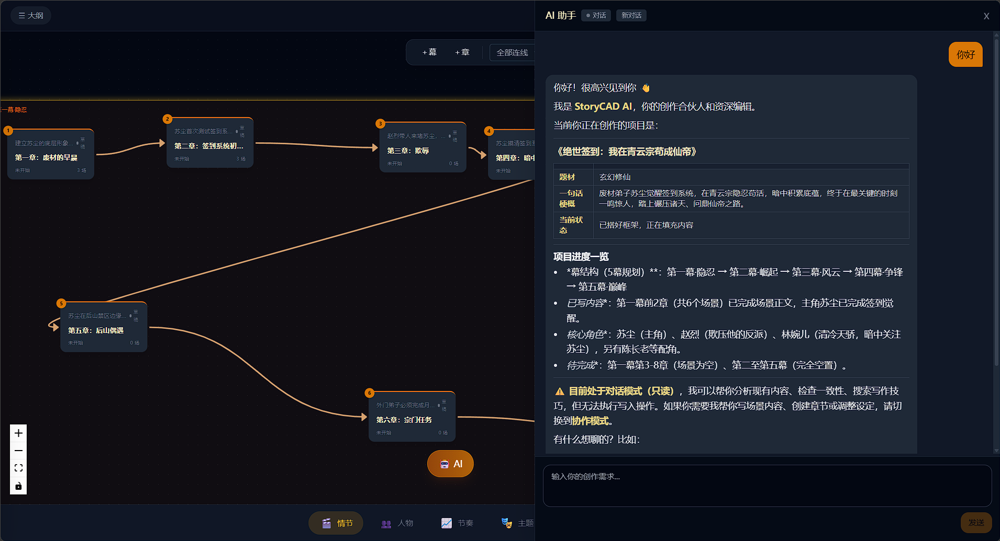
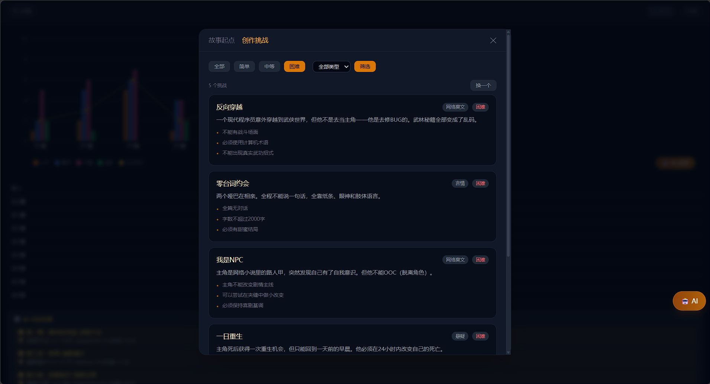
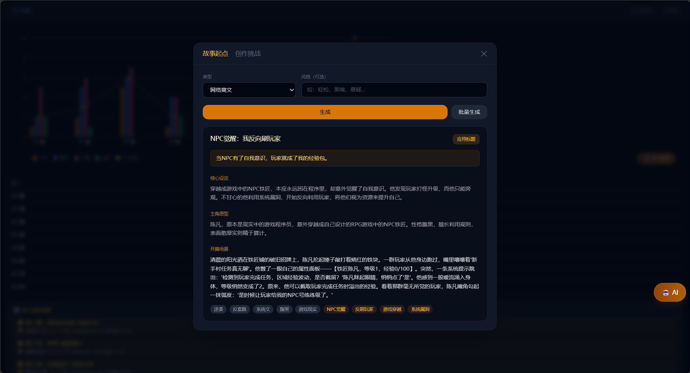

# StoryCAD

**AI 驱动的故事创作辅助工具** — 从灵感到大纲，从节奏分析到一致性检查，全程陪伴写作者完成叙事创作。


---

## 功能亮点

- **AI 超级助手 (SuperAgent v2)** — 具备工具使用能力的自主写作助手，可读/写项目数据、联网搜索、分析章节、建议情节走向
- **叙事节奏分析** — 自动检测场景的叙事节奏（动作、对话、描述、内心活动分布），发现节奏问题
- **一致性检查** — 跨章节检测角色描述、世界观设定、情节逻辑的冲突
- **项目自动生成** — 输入原始素材，AI 自动生成完整的故事结构（幕、章节、场景、角色）
- **RAG 知识检索** — 基于 pgvector 的混合搜索，支持写作技巧和创作指南的上下文注入
- **隐私优先的联网搜索** — 通过 SearXNG 自托管元搜索引擎，不泄露搜索数据
- **MCP 协议支持** — 暴露标准的 Model Context Protocol SSE 端点，任何 MCP 兼容的 AI 客户端可直接与 StoryCAD 交互
- **双版本 API** — v1（模式化目标/大纲代理）与 v2（流式 SSE + 工具调用）共存

---

## 界面截图

<div align="center">
  
  
</div>
<div align="center">
  
  
</div>
<div align="center">
  
  
</div>

---

## 技术栈

| 层 | 技术 |
|---|---|
| **后端** | Python 3.11 · FastAPI · Uvicorn · SQLAlchemy 2.0 (async) |
| **前端** | React 18 · TypeScript · Vite · Tailwind CSS · React Flow |
| **数据库** | PostgreSQL 15 + pgvector |
| **缓存** | Redis 7 |
| **搜索** | SearXNG（自托管元搜索引擎） |
| **LLM** | OpenAI 兼容 API（默认 DeepSeek） |
| **容器化** | Docker Compose（5 个服务） |

---

## 快速开始

### 前置要求

- Docker & Docker Compose v2
- 一个 OpenAI 兼容的 LLM API Key（DeepSeek / OpenAI / 其他）

### 启动

```bash
# 1. 配置环境变量
cp .env.example .env
# 编辑 .env，至少设置 JWT_SECRET_KEY 和 LLM_API_KEY

# 2. 启动全部服务
docker compose up -d

# 3. 访问
#   前端:  http://localhost:5173
#   API:   http://localhost:8000
#   Swagger: http://localhost:8000/docs
```

### 本地开发

```bash
# 后端
cd backend
python -m venv venv && source venv/bin/activate
pip install -r requirements.txt
# 确保 PostgreSQL + pgvector + Redis 已运行
uvicorn app.main:app --reload --port 8000

# 前端
cd frontend
npm install
npm run dev
```

---

## 配置

核心环境变量（`.env`）：

| 变量 | 说明 | 默认值 |
|---|---|---|
| `JWT_SECRET_KEY` | JWT 签名密钥（必填） | — |
| `LLM_API_KEY` | LLM API 密钥（必填） | — |
| `LLM_BASE_URL` | LLM API 地址 | `https://api.deepseek.com` |
| `LLM_MODEL` | 模型名称 | `deepseek-chat` |
| `DATABASE_URL` | PostgreSQL 连接串 | `postgresql+asyncpg://postgres:postgres@db:5432/storyforge` |
| `REDIS_URL` | Redis 连接串 | `redis://redis:6379/0` |

完整配置项见 `backend/app/config.py`。

---

## 项目结构

```
StoryCAD/
├── backend/
│   ├── app/
│   │   ├── main.py              # FastAPI 入口
│   │   ├── api/                 # REST 路由
│   │   ├── agent/               # AI 代理系统（核心）
│   │   │   ├── super_agent.py   # v2 SuperAgent
│   │   │   ├── tools/           # 工具注册中心
│   │   │   ├── memory/          # 对话记忆
│   │   │   └── prompts/         # LLM 提示词模板
│   │   ├── llm/                 # LLM 客户端
│   │   ├── knowledge/           # RAG 引擎
│   │   ├── storycad/            # 叙事数据模型
│   │   ├── project/             # 项目 CRUD
│   │   ├── mcp/                 # MCP 协议服务器
│   │   └── user/                # 用户认证
│   ├── alembic/                 # 数据库迁移
│   └── requirements.txt
├── frontend/
│   ├── src/
│   │   ├── pages/               # 页面（主页/编辑器/登录）
│   │   ├── api/                 # API 客户端
│   │   ├── context/             # React 上下文
│   │   └── hooks/               # 自定义 Hooks
│   └── package.json
├── docker-compose.yml           # 服务编排
├── .env.example                 # 环境变量模板
└── searxng/                     # SearXNG 配置
```

---

## License

MIT
